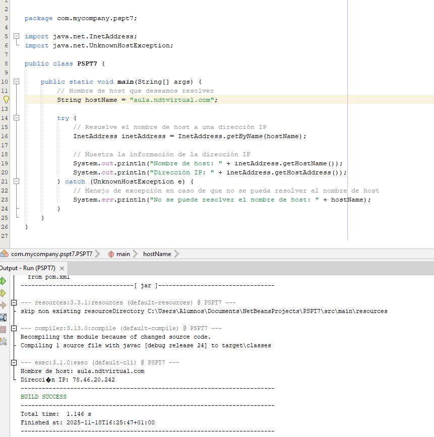

# Tema 7
# Sincronizar varios hilos
# 1.Conceptos teoricos. Desarrollar cada concepto brebemente

## 1.1. Capas del modelo OSI. Explicalos brevemente 

La estandarización del modelo OSI dicta cómo deben funcionar las comunicaciones entre redes

Se divide en 7 capas:
* Capa física: se encarga de la transmisión física de datos a través del medio de transmisión, como cables, fibra óptica o señales inalámbricas.
* Capa de enlace de datos: comunicación fiable y sin errores entre dos dispositivos en la misma red local.
* Capa de red: Esta capa enrutará (ruta más óptima las redes). Su objetivo principal es hacer que los datos lleguen desde su origen
a su destino.
* Capa de transporte: transporte de datos fiable y orientado a la conexión entre dos dispositivos que pueden estar en redes diferentes
* Capa de sesión: establece, administra y termina las sesiones de comunicación entre dos dispositivos.
* Capa de presentación: esta capa se encarga de la representación de datos y la traducción entre formatos de datos.
* Capa de aplicación: es la capa superior y se relaciona directamente con las aplicaciones y servicios de usuario final.

## 1.2. Capas del modelo TCP/IP. Explicalos brevemente

EL protocolo TCP/IP consta de las siguientes capas:
* Capa de aplicación: compuesta por aplicaciones red
* HTTP: comunica servers con navegadores web
* SMTP: gestiona el correo electrónico
* DNS: traduce a direcciones IP los dispositivos de la red
* FTP: transferencia de ficheros
* NFS: compartir ficheros en diferentes ordenadores de una red
* TELNET: conexión remota de terminales
* Capa de transporte: proporcionar servicios de transporte de datos, entre dispositivos en diferentes redes.
* Capa de Internet: elementos software que dirigen los paquetes por la red
* Capa de red: elementos hardware de comunicaciones, tarjetas red, cables…

## 1.3. ¿Cuales son las diferencias entre los modelos OSCI y TCP/IP?

El modelo OSI es más completo y teórico, mientras que el modelo TCP/IP es más simple y se ajusta mejor a la realidad de las redes de Internet. 

Ambos modelos son útiles en diferentes contextos. Ejemplo de usos:
* Modelo OSI: planificación de redes a gran escala, proyectos de investigación, enseñanza…
* Modelo TCP/IP: redes pequeñas y menos complejas como empresariales y domésticas, administrar sistemas…

## 1.4. Explique la diferencia clave entre los protocolos TCP y UPD y proporcione ejemplos de situaciones en las que se utilizaría cada uno de ellos.

#### TCP (Protocolo de Control de Transmisión):
* La misión es proporcionar un transporte de información confiable entre el emisor y el receptor.
* Garantizará que la información se entregue sin errores.
* Este protocolo parte el mensaje que se quiere enviar en paquetes, enviandolos por el canal de comunicación.
* A estos paquetes les irá asignando un número para que, una vez lleguen a su destino, puedan ser reconstruidos.
* Este protocolo es fiable.
* El protocolo TCP no es sencillo de implementar
* Ej: HTTP, FTP, Telnet...

#### UDP (Protocolo de Datagramas de Usuario):
Protocolo que no está orientado a conexión. Esto implica que no va a tener ningún tipo de sincronización para el envío de mensajes entre el emisor y el receptor.

* Uso: Aplicaciones que no van a necesitar asignación de control de secuencia ni de control de flujo en las transmisiones que se hagan.
* La partición del mensaje se envía sin control ninguno, pudiendo llegar o no al destinatario. No hay numeración.
* Prima más la velocidad de entrega de paquetes, las conocidas como aplicaciones en tiempo real (streaming o transmisión de voz).
* Este protocolo no es fiable, no garantiza la llegada de todos los paquetes
* Mucho más rápido y menos complejo que TCP.
* Ej: DHCP, DNS…

## 1.5. ¿Por que es inportante el conccepto de puertos en la comunicación en red? Explica brevemente los tipos de puertos.

Para lograr que la información llegue al otro extremo usaremos la capa de red para llegar a la dirección IP destino.

Pero no es tan sencillo, tendremos que indicar a dónde van dirigidos dichos paquetes. Podemos definir direcciones de transporte para que nuestra aplicación pueda estar a la escucha. Esto es lo que conocemos como puerto.

La mayoría de puertos se asignan de forma aleatoria, al primero que se encuentre libre. Hay aplicaciones que ya tienen un puerto asignado.

La IANA (entidad) es la encargada de asignar los puertos predefinidos:
* Puertos conocidos:  reservados a aplicaciones estándar del 0 al 1023

  a. 21 - Protocolo FTP

  b. 80 - Protocolo HTTP
* Puertos registrados: puertos asignados para servicios o aplicaciones específicas del 1024 al 49151. Aptos para su uso.
* Puertos dinámicos: se usa para conexiones temporales del 49152 al 65535. 

# 2. Ejercicios practicos

## 2.1 Ejercico 1: Descarga el archivo "ejemploInetAddress" y pruebalo con varias paginas web. Esto te dara informacion sobre la pagina web. Adjunta capturas de pantalla de la ejecucion

#### Con NDT

#### Con Youtube

