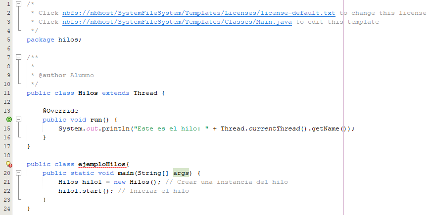

# 1. Conceptos teoricos. Desarrollar cada concepto brevemente.

## 1.1 Ventajas y desventajas del uso de hilos.
### Ventajas:
- Recurso compartidos.
- Uso eficiente y ahorro de memoria
- incremento en la capacidad de respuesta
- Paralelismo real
### Desventajas
- El multihilo no es soportado por todos los lenguajes de programación
- Incremento de complejidad para el programador
## 1.2 Recursos de un hilo
### Recursos propios:
- Identificador único, cada hilo podrá ser identificado
- Contador de programa, el hilo ejecutará su codigo de forma independiente
- Conjunto de registros asocidados, el hilo puede realizar sus operaciones aritmetico-logicas de forma independiente
- Pila propia, el hilo puede hacer llamadas a funciones de forma independiente
### Recursos compartidos
- Codigo a ejecutar
- Variables globales
- Recrsos del sistema operativo(fichero, sockets, bbdd)
## 1.3 Estados de un hilo
- Nuevo
- Listo/Ejecutable
- En ejecucion
- Bloqueando/En espera
- Finalizado/Terminado
## 1.4 Metodos para hilos en java
### Enumera y describe los principales metodos para la clase Thread:
- new(). Crea el hilo
- start(). Hilo listo para ejecutarse
- run(). Ejecucion del hilo
- sleep(). Bloqueo del hilo en ms
- wait(). El hilo espera la ejecucion de otra tarea
- getState(). Devuelve el estado del hilo
# 2. Ejercicios teoricos

## 2.1 ¿Cual es la diferencia entre un proceso y un hilo en el contexto de la programacion concurrente

 Un proceso es una instancia de un programa en ejecución que está aislado de otros procesos en la misma máquina. En particular, tiene su propia sección privada de la memoria de la máquina.
 Y un hilo es la unidad más pequeña a la cual un procesador puede asignar tiempo. Los threads poseerán la secuencia más pequeña de instrucciones a ejecutar. Los threads se crean, ejecutan y
 mueren dentro de los procesos, siendo capaces de compartir información entre ellos. Los procesos se ejecutan en el sistema operativo y los hilos dentro de los procesos.
 
## 2.2 Explica en tus propias palabras como pueden comunicarse los hilos en un programa multihilo
En los programas multhilo, los hilos pueden comunicarse compartiendo información o enviándose datos entre ellos. Como todos los hilos de un mismo proceso comparten la misma memoria pueden usar variables o estructuras comunes para intercambiar información. Para evitar errores cuando varios hilos acceden al mismo dato al mismo tiempo, se usan mecanismos de sincronización como bloqueos, semáforos o colas. De esta forma, los hilos pueden trabajar juntos sin interferirse.

## 2.3 Escribe el codigo necesario para crear un hilo con Thread. Adjunta una pantalla del codigo y explicalo

- 1. En la clase MiHilo se extiende Thread y se sobreescribe el método run().
- 2. En el método main(), se crea una instancia de MiHilo.
- 3. Método start(): Se invoca el método start() para iniciar el hilo. Esto inicia una nueva secuencia de ejecución que llama al método run() en el hilo creado.
 
## 2.4 Explica el concepto de exclusion mutua en la programacion multihilo
es una construcción de programación que garantiza que solo un proceso a la vez pueda acceder a un recurso o fragmento de código en particular. Se usa comúnmente en el
desarrollo de software para evitar que varios subprocesos modifiquen simultáneamente los datos compartidos, lo que puede conducir a un comportamiento impredecible y 
erróneo en un programa.

## 2.5 Bibliografia

unir. (s. f.). Unir. https://www.unir.net/revista/ingenieria/programacion-concurrente/
articulos. (s. f.). Codigofacilito. https://codigofacilito.com/articulos/threads-procesos
Programación multihilo. . . | dbtutoriales. (s. f.). https://dbtutoriales.com/tutorial/tutorial-de-iniciacion-a-java/page/programacion-multihilo-threads-y-concurrencia
Nivardo. (2024, 10 septiembre). Cómo Crear un Hilo en Java. Oregoom.com. https://oregoom.com/java/crear-hilo/
What is Mutex (Mutual Exclusion) - Cybersecurity Terms and Definitions. (s. f.). https://www.vpnunlimited.com/help/cybersecurity/mutex?srsltid=AfmBOorX7gS5WPcg5vVhjTU6QBVpO0ghS9hjpet19eHT5Q4FZZz4TkqI

