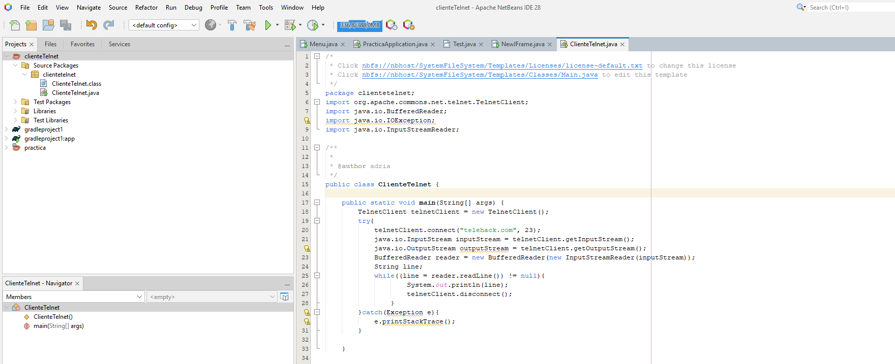
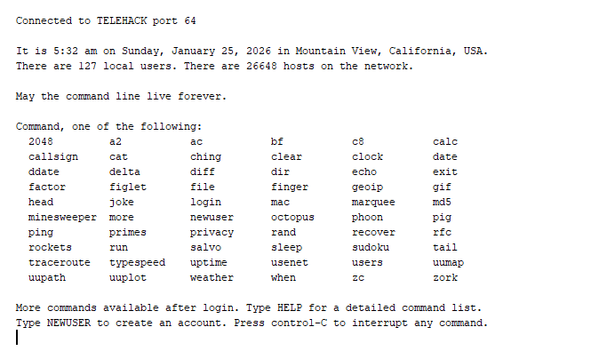
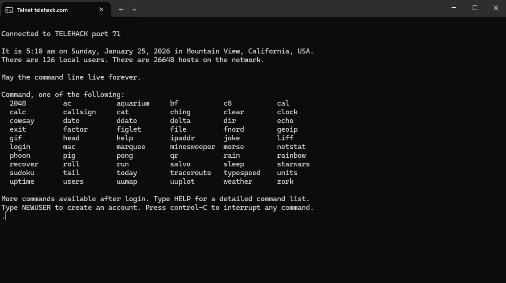
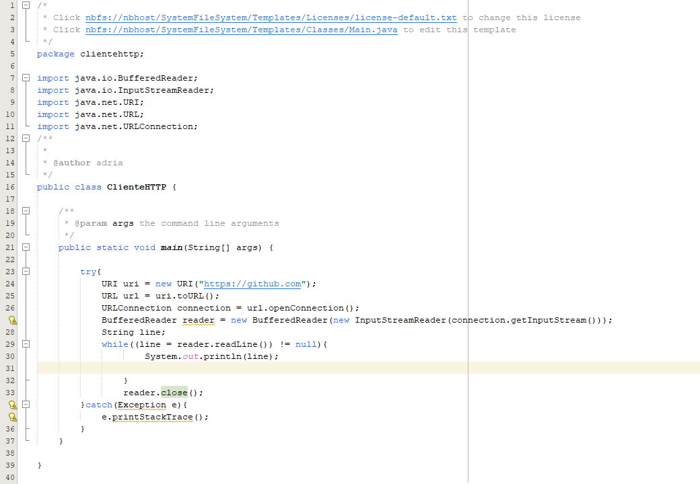
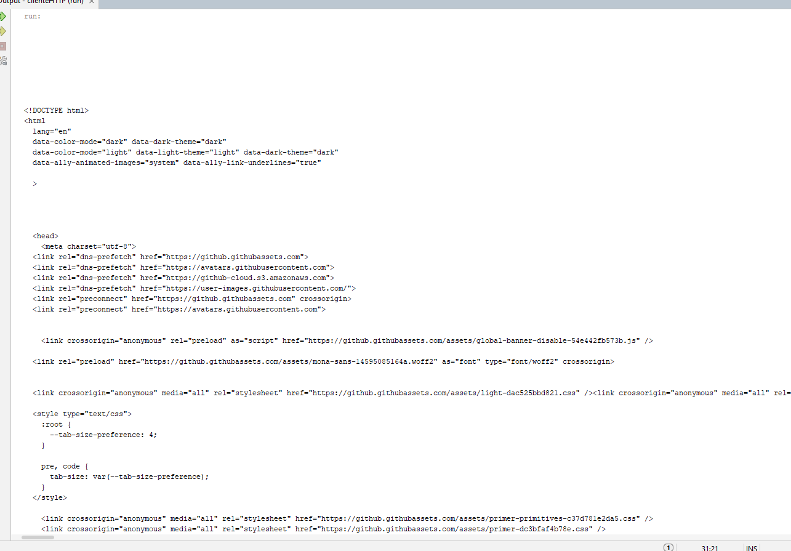

# Programacion Telnet

## Forma 1: Crea el archivo clienteTelnet.java

### Codigo:

### Compila y ejecuta el programa desde una terminal:

## Forma 2: Activa el cliente Telnet de windows

# Cliente HTTP

## Codigo:

## Ejecución:

